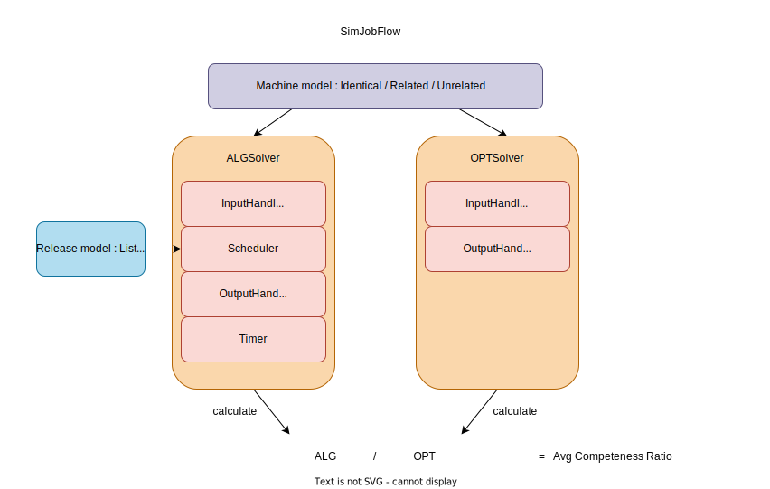
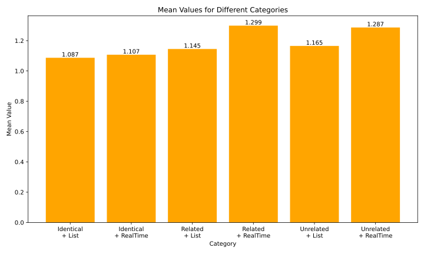

# SimJobFlow: A Simulated Job Scheduling System

I developed this project for the SJTU-CS1962: Online Algorithms course. The project implements a simulated scheduling system to evaluate the average competeness ratio of online scheduling algorithms.

## Intuition

In class, we learned about the theoretical analysis methods of online scheduling algorithms and used the competeness ratio to evaluate the performance of these algorithms. However, the competeness ratio discussed in class only assesses the worst-case performance of the algorithms, while in reality, we are more concerned with their average-case performance. To better evaluate the performance of algorithms, we need a simulated scheduling system to calculate the average competeness ratio (i.e., the average-case ALG / OPT) in practical scenarios. This metric can serve as a guide for selecting scheduling algorithms in real-world production and as experimental validation for theoretical analysis of the average-case performance of scheduling algorithms.

## Project Overview

The project flowchart is as follows:



+ ALGSolver

For `ALGSolver`, its core code is as follows. In each round, `InputHandler` retrieves the newly arrived tasks, `Scheduler` performs the scheduling, `OutputHandler` outputs the scheduling results, and finally, `Timer` advances the timestamp:

```cpp
    /**
     * @brief Start the scheduling rountine
     * @return The time taken to complete the scheduling
     */
    int64_t start()
    {
        while((!input_handler_ -> done()) || (!scheduler_ -> done()))   
        {
            auto timestamp = timer_ -> timestamp(); // get the current timestamp
            std::vector<JobT> jobs_for_this_turn = input_handler_ -> getJobs(timestamp);
            // get the input jobs

            std::vector<ScheduleStep> schedule_steps;
            schedule_steps = scheduler_ -> schedule(jobs_for_this_turn, machines_, timestamp);
            jobs_.insert(jobs_.end(), jobs_for_this_turn.begin(), jobs_for_this_turn.end());
            // The scheduler may schedule the jobs to some machines, and fill in the schedule steps

            output_handler_ -> output(machines_, jobs_, timestamp, schedule_steps); // output the scheduler steps
            scheduler_ -> updateMachineState(machines_, timer_ -> tick(machines_));
            // Scheduler is responsible for update the machine state, e.g, remaining time of the machine.
            // This task is given to the scheduler rather than the timer is because the scheduler 
            // can update some inner data structures at the same time.
        }
        output_handler_ -> output(timer_ -> timestamp());
        return timer_ -> timestamp();
    }
```

+ OPTSolver

For `OPTSolver`, it uses a backtracking method for brute-force search:

```cpp
    /**
     * @brief Start the scheduling rountine
     * @return the OPT result
     */
    int64_t start()
    {
        backtrace(0, 0);
        output_handler_ -> output(machines_, jobs_, best_schedule_steps_);
        output_handler_ -> output(best_total_timespent_);
        return best_total_timespent_;
    }
```

## Project Features

+ Polymorphism using C++ 20 concepts and templates

+ Well-commented code

## Environment Configuration

+ Compiler: gcc/10.3.0

+ Json library: nlohmann_json/3.11.3

+ Logging library: NanoLog/0.91

You can use the [scripts/env_start.sh](./scripts/env_start.sh) script to configure the environment.

## Experimental Results

Here, since the runtime of OPT grows exponentially with the increase in the number of tasks and task durations, only simple cases can be tested. I tested a very simple case:

+ The number of machines is 2, and for the related model, the processing speed is set to `[1, 3]`.

+ The number of jobs is randomly sampled uniformly between `[2, 5]`.

+ The arrival time of tasks is simulated using a Poisson distribution with `"Poisson_Lambda": 2.0`.

+ The duration of tasks is randomly sampled uniformly between `[1, 10]`.

For this scenario, the test results of the completeness ratio are shown in the following figure:



As can be seen, for simple cases, the greedy algorithm performs exceptionally well, closely matching the OPT algorithm.

I originally intended to conduct more tests, but when I increased the number of machines to 3 and the number of tasks to 6, the program could no longer terminate within 1 hour (the search space for OPT became too large, and there was a risk of stack overflow). 

Therefore, this also highlights the significance of theoretical analysis: 
Due to hardware limitations, we often cannot compute the optimal solution for a given scenario within a finite time.

## Project Restrictions

+ For simplicity, the basic unit of elapsed time is 1.

+ Since OPT is an NP algorithm, limited by hardware resources, I cannot test cases with too many tasks or tasks with excessively long total durations.

## Future Improvements

+ Implement more algorithms.

Due to the large workload, I did not implement all the algorithms discussed in class, including the MR algorithm, slow fit algorithm, etc. Additionally, other online scheduling algorithms could also be implemented.

+ OPT's runtime is too slow! Parallel optimization could be considered to enable testing more cases.

+ Use real-world data, i.e., scheduling traces, as input for experiments. For example, we can use Ali-trace data.

## Online Algorithm Documentation

For lecture notes related to online scheduling algorithms, please refer to [docs/online_scheduling_notes.pdf](docs/online_scheduling_notes.pdf).